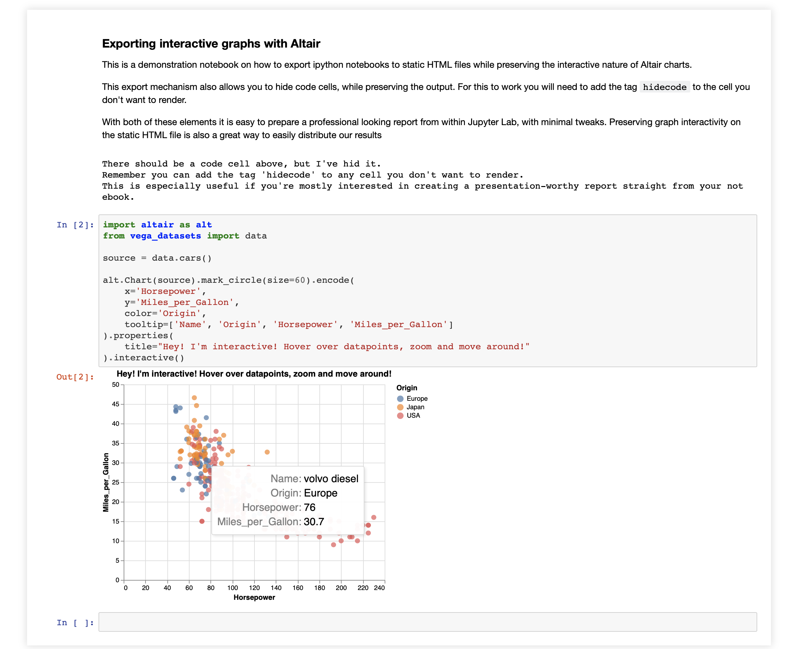

This example shows you how to render a jupyter notebook into html and have the Altair plots be interactive.
I got the code and script from this blog post by [Octavi Font](http://octavifs.me/static/interactive-graphs-on-static-notebooks-with-altair/altair_static_interactive.html). 
Note there is also a couple of cells in there with hidden code.

Example:



## Usage
To create the HTML file of the jupyter notebook, navigate to this directory and run

```jupyter nbconvert --to html --template  nbconvert_altair_hidecode.tpl altair_static_interactive.ipynb```

## Caveats
Unfortunately, at the moment it is not easy to auto-generate references/citations *AND* have interactivity in your Altair plots so you cannot have your cake and eat it too. I'm sure this will change in the future, they're actively working on it and there are several workarounds already.
