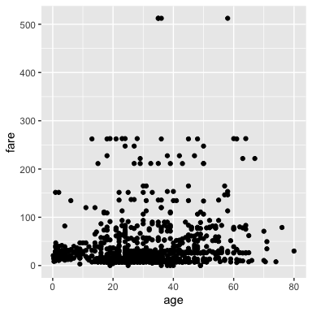

Testing Python
================

## Python in `.Rmd` files

### Load libraries

Just like R, you can use Python in `.Rmd` files\! Here we import our
libraries

``` python
import pandas as pd
import altair as alt
```

### Load data

Let’s load the titanic data and view the top of the data set:

``` python
titanic  = pd.read_csv("../data/titanic.csv")
titanic.head()
```

    ##    pclass  survived  ...   body                        home.dest
    ## 0       1         1  ...    NaN                     St Louis, MO
    ## 1       1         1  ...    NaN  Montreal, PQ / Chesterville, ON
    ## 2       1         0  ...    NaN  Montreal, PQ / Chesterville, ON
    ## 3       1         0  ...  135.0  Montreal, PQ / Chesterville, ON
    ## 4       1         0  ...    NaN  Montreal, PQ / Chesterville, ON
    ## 
    ## [5 rows x 14 columns]

### plot data

I currently cannot make altair work in `.Rmd` chunks, but it doens’t
bother me so much given that I can pass the python data frame into
`ggplot` using `py$data_frame` syntax 🤷.

``` r
ggplot2::ggplot(py$titanic, aes(x = age, y = fare)) +
  geom_point()
```

<!-- -->

### And inline python code within markdown text\!

Here we find the destination of the first passenger:

``` python
first_dest = titanic["home.dest"][0]
```

The destination of the first passenger is St Louis, MO.
